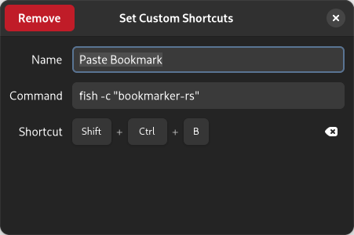

# Bookmarker

Bookmarker is a light, dmenu-powered, program-independent bookmark saver & paster.

## Features
- Paste saved bookmarks
- Assign aliases to bookmarks

## Building & Installing

You will need to install [Cargo](https://doc.rust-lang.org/cargo/getting-started/installation.html) to build this project.\
This program requires the packages `xdotool` and `dmenu` as well.

```sh
> yay -Sy xdotool dmenu
```

While inside the repository execute the following commands:

```sh
> cargo build --release
> cp target/release/bookmarker-rs .
```

or if you want to install it to your system:

```sh
> cargo install --path .
```

Do not forget to add your cargo binary directory to your path variable.

## Setup

After having installed the program you need to bind the execution of the program to a hotkey.

In the field where you enter the custom command to execute add one of the following:

- `fish -c "bookmarker-rs"`
- `bash -c "bookmarker-rs"`

Or the corresponding command for the shell of your choice.

On Gnome it would look like this:

Settings -> Keyboard -> View and Customise Shortcuts -> Custom Shortcuts

\
